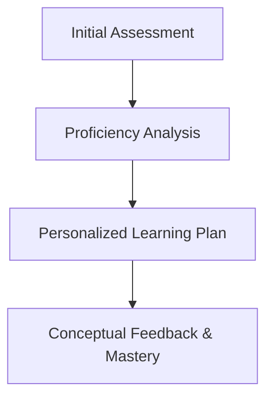

# AssessPal | AI-Powered Skill Lifecycle Agent

AssessPal is a comprehensive AI agent designed to manage the entire skill-building lifecycle—from initial proficiency assessment to continuous learning and progress tracking.

# The AssessPal Vision

AssessPal doesn't just evaluate; it guides. The agent follows a structured pedagogical flow:
1. Ability Diagnostics: Uses dynamic technical probing to determine precise skill levels and identify weak areas.
2. Personalized Curriculum: Generates a step-by-step learning plan with clear goals and prioritized topics.
3. Conceptual Feedback: Helps users learn from mistakes by explaining correct answers and technical concepts in detail.

# Setup & Demo

- Local Setup: Open `index.html` in your browser.
- Mock Demo Mode: Configured for high-fidelity demonstration of the assessment-to-plan workflow.

#Architecture

#Scoring & Logic Description

AssessPal uses a multi-stage heuristic:
-Relevance Detection: Detects vague or non-technical answers during assessment.
-Adjacent Skill Mapping: Focuses learning on skills that build upon existing knowledge.
-Curated Resources: Each roadmap step includes time estimates and direct links to documentation.

#Sample Inputs & Outputs
- Input: Resume (React, JS) + JD (Senior Engineer with Next.js/TS).
- Output: 4-week roadmap focusing on TS types, Next.js hydration, and CI/CD automation.
